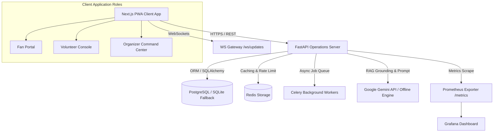

# FIFA World Cup 2026 - Stadium Operations & Fan Portal System
## ARCHITECTURE & SYSTEM DESIGN SPECIFICATION (v2.0 Enterprise)

This document outlines the architecture, database schema, security boundaries, offline resilience strategies, and traceability matrix of the GenAI-Enabled Stadium Operations & Fan Experience System.

---

## 1. System Topology & Context

The platform uses a decoupled, scalable micro-architecture topology:

### Key Scale and Performance Decisions:
- **FastAPI / Python Backend**: Decoupled clean architecture (`API` $\rightarrow$ `Services` $\rightarrow$ `Repositories` $\rightarrow$ `DB`). High-throughput async request processing with Pydantic typing and automatic OpenAPI specs.
- **Next.js PWA Frontend**: Modular client-side rendering with Service Worker offline caching (`sw.js`), IndexedDB sync, WebSockets real-time sync, and WCAG 2.2 AA+ accessibility.
- **PostgreSQL Database**: Primary relational database with database indexing on high-frequency query columns (`username`, `gate`, `zone`, `route`, `timestamp`).
- **Redis & Celery**: Distributed cache, sliding-window rate limiting, and async background job offloading.
- **Prometheus & Grafana**: System observability capturing request latency, throughput, error rates, and active WebSocket connection metrics.

---

## 2. Core Operational Modules

The codebase comprises seven core operational modules:

1. **Conversational Multilingual Assistant (F-01)**: Integrates speech synthesis (TTS), RAG context retrieval, and Dijkstra pathfinding route optimization across gates.
2. **Crowd Flow Predictor & Advisory (F-02)**: Monitors zone crowd density percentages (0% - 100%) and computes predictive forecasts (15m, 30m, 60m) with actionable advisories.
3. **Accessible Navigation Engine (F-03)**: Computes multi-criteria wayfinding routes verifying accessibility features (wheelchair ramps, elevators, escalators) against anchored coordinate nodes.
4. **Transport Coordination Assistant (F-04)**: Summarizes transit status logs (delays, suspensions) for Metro, bus, and shuttle routes, pushing instant updates via WebSockets.
5. **Sustainability Nudge Engine (F-05)**: Locates nearest eco-features (refill points, recycling bins, EV shuttles) and calculates personalized Green Scores, plastic saved, and CO₂ reductions.
6. **Operational Intelligence Dashboard (F-06)**: Asynchronously compiles dynamic executive briefs for organizers using Celery background workers.
7. **Real-Time Decision Support Copilot (F-07)**: Analyzes reported incidents against SOP rules, environmental metrics, and weather data; requires RBAC approval before public broadcast.

---

## 3. Database Schema

The database schema utilizes six relational tables with indexing:

### `users` (Authentication & Access Control)
- `id` (INTEGER, PK)
- `username` (VARCHAR, Unique, Indexed)
- `hashed_password` (VARCHAR)
- `role` (VARCHAR) - `fan`, `volunteer`, `organizer`, `admin`
- `is_active` (BOOLEAN)

### `wayfinding_nodes` (Verified Waypoints)
- `id` (INTEGER, PK)
- `name` (VARCHAR, Unique, Indexed)
- `zone` (VARCHAR)
- `has_wheelchair_ramp` (BOOLEAN)
- `has_elevator` (BOOLEAN)
- `has_escalator` (BOOLEAN)
- `restroom_nearby` (BOOLEAN)
- `first_aid_nearby` (BOOLEAN)
- `coordinates_lat` (FLOAT)
- `coordinates_lng` (FLOAT)

### `sop_rules` (Emergency Procedures)
- `id` (INTEGER, PK)
- `scenario` (VARCHAR, Unique)
- `action_plan` (VARCHAR)

### `incidents` (Incident Logs)
- `id` (INTEGER, PK)
- `title` (VARCHAR)
- `description` (VARCHAR)
- `gate` (VARCHAR, Indexed)
- `severity` (VARCHAR, Indexed) - `low`, `medium`, `high`
- `status` (VARCHAR, Indexed) - `draft`, `active`, `resolved`
- `suggested_action` (VARCHAR)
- `is_approved` (BOOLEAN)
- `timestamp` (DATETIME, Indexed)

### `transit_alerts` (Transit Logs)
- `id` (INTEGER, PK)
- `route` (VARCHAR, Indexed)
- `status` (VARCHAR) - `normal`, `delayed`, `suspended`
- `delay_minutes` (INTEGER)
- `timestamp` (DATETIME)

### `crowd_sensors` (Telemetry Aggregation)
- `id` (INTEGER, PK)
- `zone` (VARCHAR, Indexed)
- `density_percentage` (INTEGER)
- `advisory` (VARCHAR)
- `timestamp` (DATETIME)

---

## 4. Security & Safety Controls

- **OAuth2 JWT Authentication**: Short-lived access tokens (30 mins) + long-lived refresh tokens (7 days) signed with HS256 algorithm.
- **Role-Based Access Control (RBAC)**: Custom FastAPI dependency `RoleChecker(["organizer", "admin"])` protects sensitive action endpoints.
- **PII Scrubbing**: Regex filters automatically sanitize ticket numbers (`TKT-XXXX`), credit cards, phone numbers, and email addresses.
- **Prompt Injection Censorship**: Input queries are scanned for hijack tokens (`ignore previous instructions`, `system prompt`) and blocked before LLM execution.
- **RAG Grounding & Output Verification**: AI generated responses are cross-checked against database waypoint names. If unverified locations are detected, response confidence is lowered or replaced with a safe fallback response (`I cannot verify this information from trusted stadium data.`).
- **OWASP Security Headers**: `SecurityHeadersMiddleware` injects strict `CSP`, `HSTS`, `X-Frame-Options`, `Referrer-Policy`, and `Permissions-Policy` headers on all HTTP responses.

---

## 5. Master Traceability Matrix

| Feature ID | Module Name | Primary Code Files | GenAI / Algorithmic Mechanism |
|---|---|---|---|
| **F-01** | Conversational Assistant | `backend/app/api/assistant.py`, `backend/app/services/ai_safety.py`, `backend/app/services/route_optimizer.py` | RAG context retrieval + Dijkstra pathfinding + Confidence score calculation |
| **F-02** | Crowd Flow Advisory | `backend/app/api/crowd.py`, `backend/app/services/analytics.py` | 15/30/60m predictive density forecasting & actionable recommendations |
| **F-03** | Accessible Wayfinder | `backend/app/services/route_optimizer.py` | Multi-criteria path optimization checking wheelchair ramps & elevators |
| **F-04** | Transport Coordinator | `backend/app/api/transport.py`, `backend/app/api/ws.py` | LLM condensation of transit bulletins + WebSocket real-time broadcast |
| **F-05** | Sustainability Nudges | `backend/app/api/sustainability.py`, `backend/app/services/sustainability.py` | Location-based eco-nudges + plastic saved & CO₂ reduction calculator |
| **F-06** | Operations Summary | `backend/app/tasks.py`, `backend/app/worker.py` | Asynchronous Celery background compilation of executive ops briefs |
| **F-07** | Decision Copilot | `backend/app/api/decision.py` | RAG matching against SOP database rules + environmental context + RBAC approval |
